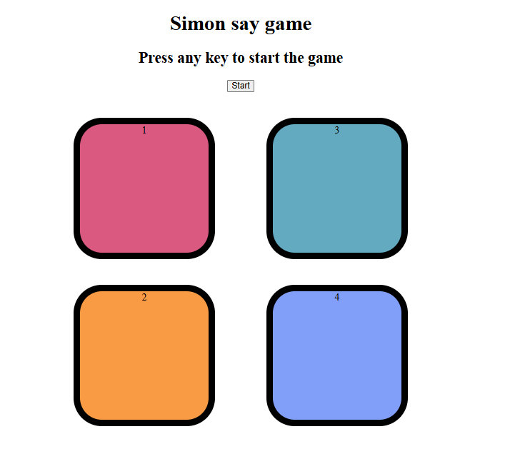
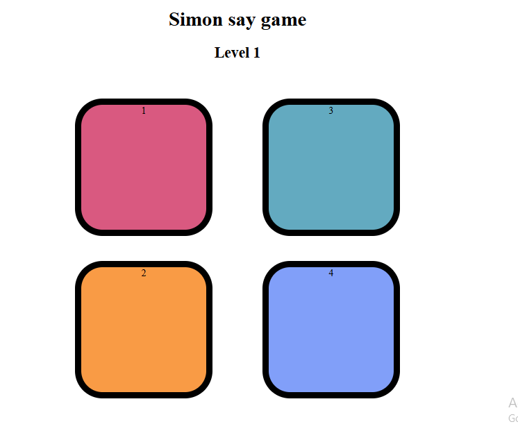

# Simon Say Game 🎮

A memory-based color sequence game built using **HTML**, **CSS**, and **JavaScript**.

🔗 **Live Demo**: [Click here to play](https://sameerdevhub.github.io/Simon-Say-Game/)

---

## 🎯 Objective

Test your memory! Repeat the flashing color sequence correctly to level up. One wrong click ends the game and shows your score.

---

## 🕹️ How to Play

1. **Start the Game**
   - Press any key on your keyboard or click the **Start** button.

2. **Level 1 Begins**
   - One colored box flashes (e.g., **Pink**).
   - Click on the same color to pass Level 1.

3. **Level 2 and Beyond**
   - Another color flashes (e.g., **Orange**).
   - Now, **repeat the entire sequence** from the beginning:
     - Level 2 = click **Pink**, then **Orange**
     - Level 3 = click **Pink**, **Orange**, and the next color
     - And so on...

4. **Game Over**
   - If you click the wrong color:
     - The game shows **"Game Over"** and your last completed level as your **score**.
   - Press any key to **restart**.

---

## 🧠 Example

### Level 1:
- Pink flashes  
✅ You click: Pink

### Level 2:
- Orange flashes  
✅ You click: Pink → Orange

### Level 3:
- Green flashes  
✅ You click: Pink → Orange → Green

🎯 Keep going as long as you can remember the full sequence!

---

## 🎨 Tech Stack

- **HTML5**
- **CSS3**
- **JavaScript**

---

## 📷 Screenshot


  

---

## 🛠️ Running Locally

1. Clone the repo:
   ```bash
   git clone https://github.com/SameerDevHub/Simon-Say-Game.git
   
2.Navigate into the project folder:
  cd Simon-Say-Game

3.Open index.html in your browser:
  start index.html

🚀 Future Improvements

   -Add background music and sound effects
   -Mobile responsiveness
   -Score leaderboard
